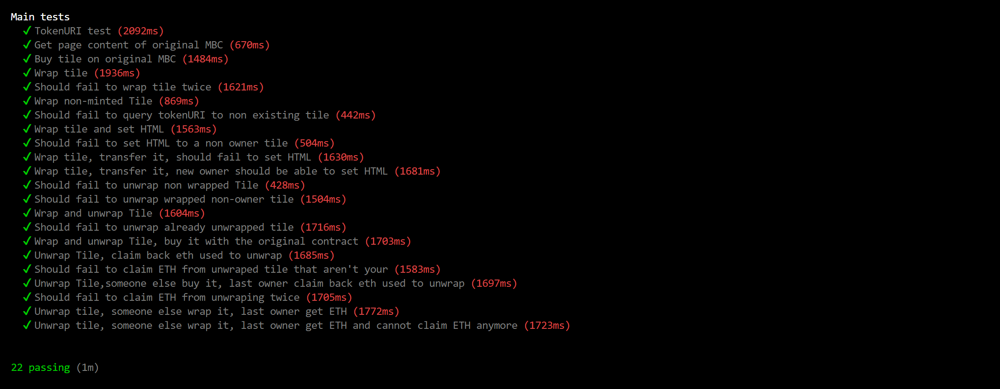

# MyBlockchainCorner ERC-721 wrapper
## This wrapper allow you to wrap tiles of the archeological NFT https://myblockchaincorner.web.app/ to trade it on openSea

## [Contract on etherscan](https://etherscan.io/address/0x090F1C3bB97591b03772994DC8964f8758cc8391)
## [Collection on OpenSea](https://opensea.io/collection/wrapped-myblockchaincorner)

## Wrapping process 

First you must set your tile for sale using the [original MBC website](https://myblockchaincorner.web.app/)

Then you use the [new contract](https://etherscan.io/address/0x090F1C3bB97591b03772994DC8964f8758cc8391#writeContract) to wrap your tile. 

This transaction also allow you to set the HTML of your tile.

Keep in mind than you must set a high price to your tile before wrapping it because some malicious user could be tempted to snipe it. 

Since original contract take a percentage of 5% of all sales, you will lose 5% of the price you set during wrapping. 

But once wrapped, you can trade your tile on openSea for 0% fees. 

## Set HTML 

Once wrapped, you can set the HTML of your tile using the wrapper ERC-721 contract, the HTML will be updated on the original contract. 

## Unwrapping process. 

If you want to unwrap your tile, you call unwrap function with a price, then you have to buy it yoursel on the original contract.

Once you bought it yourself, you must call the wrapper to get back the ETH you spent to buy your tile.

The same caveats for the wrapping process apply here (sniping issue and 5% lose)

# Technical specs 

## Battle tested
The wrapper contract has been tested on every case and isn't vulnerable to attacks.

Tests are done on a fork of mainnet with the real state of original MBC contract.

## On chain pictures
To preserve the on-chain spirit of the project, no external link (not even IPFS) is used to display properties and image of the token on website like openSea. 

All data is generated on chain with a SVG picture showing which page and coordinate is the tile.

